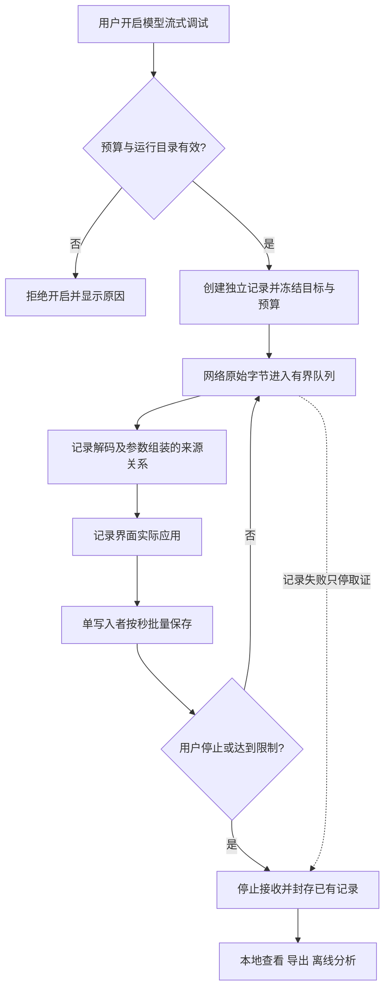

# 模型流式调试模式详细方案

> 状态：用户确认“去做吧”，按本文开始实施；批准方案不代表功能已经完成。
>
> 文档位置说明：仓库目前没有 `.codestable/attention.md`、统一设计目录和行动清单校验器。后续若启用该工作流，应先补齐骨架。本次仅在现有文档区保存独立草案，不为一个调试功能顺带初始化整套流程；确认前不生成表示“已经批准实施”的清单。

## 先看结论

1. 在“全局设置 → 其他”增加“流式输出调试”，默认关闭。开启代表直接记录原文，不另设敏感信息或原文许可开关。
2. 同时留下网络接收、消息解析、工具参数拼接、界面应用四个位置的记录；每次增长都能追到来源，不能只记“还在输出”。
3. 单次最多 32 兆、最长 30 分钟，正常情况下每秒批量写入一次；到限只停止调试记录，不停止正在进行的模型任务。
4. 原文按新增片段保存一次，后续处理引用它；不在每个片段到达时重新保存累计全文。
5. 记录独立于聊天数据库和现有滚动日志，关闭或异常后保留，绝不为了继续记录而自动覆盖已有现场。
6. 重启后调试保持关闭。只能从开启时开始取证，不能恢复开启前没保存的原始消息；超过预算、漏记、异常退出必须明确标为不完整。
7. 客户端可以区分“入口已经收到重复内容”和“本地重复处理”；入口之前到底是模型还是中转服务的问题，仍需服务端记录进一步区分。

## 0. 术语约定

| 中文名称 | 代码标识建议 | 含义与边界 |
| --- | --- | --- |
| 调试模式 | `DebugCapture` | 本功能的按需取证，不是程序单步调试器，也不是全系统性能分析。已查现有代码，没有同名产品功能。 |
| 一次取证 | `DebugCaptureRun` | 用户一次开启到停止之间的独立记录，不等同于一个对话、一轮回答或一次模型请求。 |
| 原始接收单元 | `TransportUnit` | 长连接库交给应用的一条消息，或普通流式连接交给应用的一块原始字节；不是加密网络包。 |
| 模型请求 | `ModelRequest` | 复用已有请求身份。同一请求的不同重试必须分别记录，不混在一个参数串里。 |
| 上游工具编号 | `providerCallId` | 上游消息中的 `call_id`，与执行后才生成的本地工具实体编号分开。 |
| 取证序号 | `captureSeq` | 本次取证内部的递增序号，不冒充已有模型消息序号或数据库提交序号。 |
| 内容引用 | `DebugPayloadRef` | 原文文件中的位置、长度与校验摘要。与现有业务效果的 `SerializableEffectPayloadRef` 分开，不借用其权威含义。 |
| 封存 | `seal` | 不再接收新记录，写完已经接收的有界队列，记录停止原因；不表示模型任务完成。 |

“完整”必须分开表达：记录有没有漏项、是否从请求开始取证、上游是否正常结束，是三件不同的事。一次完整记录下来的失败，仍然是有用且完整的失败现场。

## 1. 决策与约束

### 1.1 用户已明确的方向

- 为团队内部开发排查问题，开启调试后直接保留上游原始消息、完整工具参数和本地处理过程，不只保存摘要。
- 不再按内容是否敏感筛选响应正文、思考文本、参数或上游错误正文，不另设“允许记录原文”确认步骤。
- 默认关闭，避免长期详细记录对硬盘造成压力。
- 单次 32 兆、最长 30 分钟、按秒批量写入、到限停止提示、不覆盖现场，已随整体方案确认。

### 1.2 成功标准

- 对“参数一直增长、工具一直未完成”的一次可复现故障，离线读取保存文件，就能查看实际收到的原文，并指出首次出现异常的处理位置和记录序号。
- 没有发生丢失、没有跨过取证边界时，能回答：收到几次、处理几次、给了哪个工具、收到完成消息没有、完成消息后来如何处理。
- 关闭状态下，本功能不创建取证目录、不创建写盘定时器、不复制原文、不计算每片段摘要、不发送取证专用界面消息。正常聊天保存和现有基础日志不受影响。
- 开启状态下，内存、单次写盘量、累计占用和工作时长均有明确上限；不能通过反复覆盖文件来规避写入预算。

### 1.3 覆盖范围

| 范围 | 本次要求 |
| --- | --- |
| 普通模型回答的长连接路径 | 完整覆盖原始消息、工具参数处理、结束、超时、取消、重试与连接复用。 |
| 普通模型回答的网页流式路径，即 HTTP/SSE | 必须覆盖，尤其是长连接失败后的自动切换；保存原始字节及应用解码结果。 |
| 上下文中的多个工具、交错思考和正文 | 必须保留原始次序与编号关系，不把后到的内容猜成前一个工具。 |
| 界面合并、重发、断线后的状态恢复 | 记录本地实际应用行为，用于排除“服务端只有一份、界面追加多次”。 |
| 非 Responses 格式的普通模型回答 | 网络字节和统一解码结果纳入通用记录；没有专用分析规则时明确显示“需人工分析”，不套用 Responses 的工具结束规则。 |
| 附件识别、压缩、模型列表、终端输出、外部工具通信 | 不在这次详细取证范围内。若任务切换到这些阶段，只记录范围离开信息，不能声称全链路覆盖。 |

记录实际模型请求正文及响应正文，用于理解输入与输出关系；不另行采集认证握手、请求头或其他配置文件。这是取证范围的划分，不是对已纳入范围的原文做内容过滤。

### 1.4 明确不做

1. 不在本功能中修复参数归属、调整模型提示词、替换解析器的业务判断、缩短模型超时或改变重试策略。
2. 不因为取证容量满了就取消模型，也不截断参数后补括号并执行工具。
3. 不自动上传记录，不连接模型服务重放请求，不执行记录里的命令或工具。
4. 不把取证文件变成聊天历史、任务恢复、工具执行或最终输出的另一份依据。
5. 不改可靠运行数据库结构，不增加运行时格式协商或旧格式迁移链。
6. 不承诺有限容量能保存无限输出，也不把不完整记录包装成已经找到根因。

复杂度定位：按现有本地扩展的默认工程要求推进；额外关注高频流式记录、磁盘写入和多窗口身份隔离，不扩展为通用日志平台。

### 1.5 已确认的默认值

| 项目 | 建议默认值 | 为什么 |
| --- | --- | --- |
| 取证目标 | 开启时选定的当前对话；可显式改为当前工作区全部对话 | 默认避免把无关后台任务一起录入。切换界面不改变已经选定的目标。 |
| 同一工作区的活动取证 | 最多一个 | 多个面板控制同一份状态，避免重复记录和重复写盘。 |
| 单次预算 | 32 MiB，含索引、原文、清单和临时写入预留 | 防止只有原文计费、索引却无限增长。1 MiB 为 1,048,576 字节。 |
| 单次持续时间 | 30 分钟，以单调时钟计时 | 修改系统时间不能让取证无期限运行。 |
| 正常写入节奏 | 约每秒一个批次 | 不按每个字符、每条消息同步写盘；开始和最终封存允许单独写入。 |
| 新增内存预算 | 排队与写入中的记录合计最多 4 MiB | 超出时停止取证并标记缺口，不堵住模型读取。 |
| 当前工作区累计保留 | 最多 128 MiB，最多 16 份 | 为新取证预留预算；不足时拒绝开启，要求用户清理，不覆盖旧记录。 |
| 原文自动删除 | 默认不自动删除 | 便于事后检查；累计预算保证不会无限积累。 |
| 重启行为 | 关闭，不自动继续上次取证 | 防止调试模式被忘记后长期写盘。 |

这里的累计上限是每个工作区运行数据目录的上限，不伪称整台机器的统一上限。多个工作区分别开启时，磁盘占用会相加；界面应显示本次作用范围。导出到用户另选位置的副本单独计入磁盘占用，不自动导出。

## 2. 名词与编排

### 2.1 名词层：现状与变化

#### 现状依据

| 编号 | 已核实的现状 | 代码或文档位置 |
| --- | --- | --- |
| E01 | 普通输出只保存第一段，后续主要更新活动信息 | `backend/reliableKernel/modelProviderControlPlane.ts:1090` |
| E02 | 工具参数片段只进入临时显示；完整工具另行处理 | `backend/reliableKernel/llmCapabilityProviderAdapter.ts:316` |
| E03 | 失败时仅保留有文字的部分回答，不保存未完成参数 | `backend/reliableKernel/llmCapabilityProviderAdapter.ts:1352` |
| E04 | 现有日志限定字段、总共四兆、会轮换，禁止正文 | `backend/reliableKernel/diagnosticJournal.ts:69`；`runtime-diagnostics.md` |
| E05 | 长连接接收后解析，再查找参数所属工具 | `backend/capabilities/openAIResponsesWebSocketSession.ts:1067`、`:1378` |
| E06 | 普通流式响应已有逐块读取和结束检查层 | `backend/capabilities/terminalValidatedFetch.ts:42` |
| E07 | 参数显示已有追加、替换、最终完成及恢复路径 | `shared/toolCallPreview.ts:56`；`webview/src/domain/reliableTransientModel.ts:64`；`webview/src/stores/useReliableKernelClientFeedStore.ts:596` |
| E08 | 全局设置已有统一读取、保存、版本冲突处理与跨窗口刷新 | `docs/global-settings-data-integration.md`；`backend/application/reliableKernel/VscodeReliableKernelCommandRouter.ts:137`、`:557` |
| E09 | 当前模型调用显式注入网络读取函数，长连接也由项目管理 | `backend/capabilities/llmProvider.ts:350`、`:594` |
| E10 | 当前依赖的调试实现会缓存全部片段，并在每个回调中拼累计全文 | 已安装 `unified-llm-provider` 0.1.35 的 `dist/llm/transport.js:173`、`dist/config/types.d.ts:43` |

E10 的结论仅针对当前依赖源码，不据此判断此次历史故障由依赖调试功能导致；当前产品并未因此被证明开启了该功能。

#### 变化：增加独立的观察对象，不改变业务对象

| 对象 | 职责 | 不承担的职责 |
| --- | --- | --- |
| 调试默认设置 `DebugCaptureSettings` | 保存取证范围的默认选择，以及允许调整的预算默认值 | 不持久化“当前已开启”，不拥有对话或请求 |
| 取证控制器 `DebugCaptureController` | 当前工作区内启停、预算、时限、状态和封存 | 不调用模型、不执行工具、不决定任务成功 |
| 取证清单 `DebugCaptureManifest` | 记录本次范围、运行身份、代码来源、字节用量、完整性、停止原因 | 不复制聊天对象，不代替数据库权威记录 |
| 取证事件 `DebugCaptureEvent` | 记录某个接收或处理事实以及明确的来源关系 | 不通过时间接近程度猜测归属 |
| 原文存储 `DebugPayloadRef` | 保存实际字节及引用位置，保持原文可复核 | 不在每条事件中重复累计全文 |
| 离线分析器 `DebugCaptureAnalyzer` | 重建参数变化，比较各层，输出证据与无法判断的边界 | 不联网，不恢复真实任务，不执行任何工具 |

配置仍放在设置目录；取证是独立的观察文件，不新增 ECS 组件或运行数据库表。不把调试开关塞进 Agent、Conversation、模型配置或 `globalState`。

#### 设置与启停接口

- 在 `GLOBAL_SETTINGS_SECTIONS` 增加 `debugCapture`，使用现有设置读写、修订冲突和跨窗口同步通道；设置文件为设置目录下的 `debug-capture.json`。
- 该 section 保存默认范围和预算。建议可选择单次 8、16、32 MiB，持续 5、15、30 分钟；不能在界面输入无限值。默认 32 MiB、30 分钟。
- 真正的开启状态只属于当前工作区运行实例，由取证控制命令管理。其他窗口读取同一份全局默认设置，不会因此自动开启取证。
- 启停、状态、查看、导出、清理是诊断操作，复用现有命令路由和诊断消息通道，增加明确的操作类型；不建立另一套设置 CRUD 通道。

接口行为示例：

```text
保存默认设置：范围=当前对话，容量=32兆，时长=30分钟
结果：使用原有设置保存流程；不会开始取证。

开启取证：命令编号=命令甲，目标=对话甲
结果：返回取证编号、实际目标、冻结预算、状态=正在记录。
再次收到同一命令编号：返回同一次取证，不创建第二份文件。
其他面板再次开启：返回当前活动取证；目标不同则明确冲突，不暗中换目标。

停止取证：取证编号=记录甲
结果：立即停止接收新记录，写完已接受队列后返回状态=已封存。
再次停止记录甲：返回相同停止结果，不报假失败。

剩余工作区预算不足：开启失败，返回所需容量、剩余容量与清理入口。
```

来源：现有 `useGlobalSettingsStore` 的设置保存协调与 `VscodeReliableKernelCommandRouter` 的命令路由；上述取证操作为新增契约。

#### 记录字段与原文保存

每条事件至少包含：取证编号、取证序号、发生时间、单调耗时、记录阶段、来源引用。请求相关事件补充对话编号、模型请求编号、重试编号和实际传输方式。

连接相关身份分开记录：程序本次启动编号、物理连接编号、连接上的请求发送序号、模型请求内部的流代次、上游响应编号。不能把“模型的第一次尝试”和“物理连接第一次建立”当成同一个编号。

工具相关事件保留：原消息里的 `item_id`、`output_index`、`call_id`，本地实际选中的工具编号，选择依据，追加或替换操作，操作前后字符数，是否收到完成消息、参数解析是否成功。尚未生成本地工具实体时，本地实体编号为空，不能用上游编号冒充。

字符数沿用现有界面的字符串长度口径，磁盘预算使用实际编码字节数，两者分开记录。网络字节原样保存；本地字符串按能够保留转义和不完整字符片段的表示保存，不能因为再次编码而把半个字符替换成另一个字符。

| 阶段 | 原文与处理内容 | 关键用途 |
| --- | --- | --- |
| 请求发送 | 实际发送的请求正文、目标地址、传输方式与请求身份；发送结果另记 | 核对是否真的重新发送请求、是否复用旧响应 |
| 网络入口 | 原始字节在 JSON 解析、流式事件拆分、工具归属查找之前记录 | 即使内容格式错误、编号错误，仍有入口原文 |
| 解码输出 | 实际产生的正文、思考、工具调用及结束事件，关联输入来源 | 查明网络有内容但解码层没交出的情况 |
| 参数组装 | 片段引用、目标工具、追加或替换、前后长度、完成或拒绝原因 | 查出重复追加、串工具、遗漏完成标记 |
| 界面应用 | 已有请求身份、消息序号或合并区间、工具编号、前后长度、追加或重建行为 | 区分正常状态恢复和错误重复显示 |
| 请求或取证结束 | 超时、取消、连接关闭、成功结束、取证到限、写盘失败等原因 | 不把“没有完成标记”误认为“日志恰好没保存” |

长连接的原始字节指长连接库交给应用的完整消息，网页流式连接则记录读取块的字节和边界。应用已经完成的解压属于记录入口之前，不声称保存了 TLS 加密包或底层 TCP 分包。

#### 来源关联要求

1. 网络入口分配独立接收序号；同一来源进入解码和参数组装时，明确携带观察上下文，不使用进程全局的“当前消息”变量。
2. 一条网页流式事件可能跨多个读取块；一个读取块也可能含多个事件，必须保存字节范围和多对多关系，不能假定一块对应一个参数片段。
3. 界面合并事件使用原有消息序号区间；状态恢复明确标为“重建”，不能把累计快照算成又收到一份网络参数。
4. 无法确定关联时写“来源未关联”，降低该请求的证据完整性；不通过时间戳或相同文字猜出一个确定来源。
5. 观察上下文不进入发送给模型的请求体，不改变工具参数，不写入业务数据库，也不参与幂等键和最终结果判断。
6. 组装记录必须观察本地实际使用的片段，不能只引用入口后就假定二者相同。实际值与入口解码值一致时可引用原文并记录摘要；不一致时另存实际值。这样长度相同但内容被改错的情况也能定位，而无需每次重算累计全文。

#### 增量保存示例

```text
入口第101条：上游工具甲，片段原文为 {"command":"
本地第205条：引用入口101，追加给工具甲，长度从0变成12
入口第102条：上游工具甲，片段原文为 echo ok"}
本地第206条：引用入口102，追加给工具甲，长度从12变成21
本地第207条：又引用入口102，再次追加，长度从21变成30
```

分析结果可以直接指出：第二个片段在入口只出现一次，但本地使用了两次；首次异常是本地第207条。原文不可因为连续相同而被去重，因为“上游确实发了两次”本身就是证据。

参数组装只记录每次变化及其引用，完整参数可以逐步重建；上游完成事件提供的最终参数必须原样保存。本地最终解析结果至多额外保存一次。中途出现替换时保留替换正文，不能只存摘要。参数一直不结束时，也应能重建截至取证停止的全部已记录内容。

### 2.2 编排层



#### 现状 → 变化

- 现状：接收、解析和显示已有流程，但中间参数不逐条保存，基础日志又会轮换，事后缺少可核对原文。
- 变化：在原流程旁边增加只观察、不决定业务结果的记录分支。正常流向和消息内容保持不变，取证分支独立失败、独立封存。
- 当前库的 `setLogging` 或普通调试回调不能直接作为实现：E10 会维护累计全文，既没有本功能的预算，也不能提供完整的本地处理来源关系。
- 普通流式读取复用现有接收位置和终止检查，不额外开一个无限缓冲的响应副本，不修改依赖安装目录，不重新实现整套模型协议。

#### 状态与边界

| 状态或触发 | 必须发生的行为 |
| --- | --- |
| 关闭 | 只有便宜的启用判断；无本功能的逐片段数据加工、定时写入或磁盘操作 |
| 正在开启 | 核验当前运行目录、累计预算与单活动记录约束，成功后才向界面显示已开启 |
| 正在记录 | 仅接收选定目标的数据；界面最多每秒更新一次用量与剩余时间 |
| 正在封存 | 固定最后接受序号；拒绝新的数据，排空已接受队列 |
| 已封存 | 文件只读；再次停止不重复写入；查看和分析不自动重启取证 |
| 达到容量或时限 | 只停止取证，明确提示已停止及原因，模型任务继续按原规则运行 |
| 写入失败或队列满 | 停止取证，保存可保存的截止信息，并明确记录不完整；不能无期限积压或循环重试写盘 |
| 扩展异常退出 | 下次保持关闭；缺少封存尾记录的现场显示“异常中断”，不伪造完整结束 |

正常的单个模型请求结束，不自动关闭整个取证时段，后续请求可继续记录，直至用户停止或预算到限；所有请求分别编号。某个请求失败也不触发取证自行重发该请求。

#### 开启时已经在组装参数

- 不重启、不重新发送当前模型请求，也不声称获得开启前的网络内容。
- 从下一条新接收消息开始记录，当前请求标记为“中途开始”。
- 若本地拥有当前组装状态，额外保存一次当前参数基线，并标明这是本地状态，不是历史网络原文；基线同样计入预算。
- 如果该状态无法取得，保留“缺少初始状态”标记，仍记录后续片段；离线分析只能判断覆盖范围内的问题。
- 一个正在运行的网页流式请求也必须能中途启用观察，不能只在创建网络请求时固定判断开关。

#### 磁盘与内存约束

1. 每次原文与事件入队前先计算所需字节并预留预算；已写入、排队中、正在写入和封存预留都算入单次上限。
2. 32 MiB 中预留 256 KiB 给清单、截止信息和临时发布文件。普通数据不能用尽全部预算后才发现停止原因无处保存。
3. 超大单条消息无法完整放入预算时，不截成看似完整的消息；记录其预计长度、未保存范围和停止原因。不能为计算摘要先无界复制整个消息。
4. 原文和索引均追加写入。每秒提交一个有界批次，不按每条消息同步刷盘；正文不反复改写，不后台循环压缩，不创建自动导出副本。
5. 队列和在途写入合计不超过 4 MiB。无法跟上输入时停止取证而不是拖慢模型读取；该请求标为有缺口，不能悄悄抽样。
6. 开启、停止和必要的错误收尾允许额外写入。频繁切换不能突破累计容量和记录份数限制。
7. 用户关闭开关后立即停止接受新数据；“正在封存”期间仅写此前已经接受的队列，完成后显示“已关闭”。

#### 保存位置与一致性

```text
当前运行目录/
  diagnostics/
    events.jsonl                         现有基础日志，规则不变
    debug-captures/
      20260907-010858-123-model-stream-a1b2c3/
        manifest.json                    范围、身份、版本来源、预算、完整性
        events.jsonl                     每一步发生了什么，及原文引用
        payloads.bin                     实际原文字节，按收到顺序追加
```

- 路径由现有 `getPaths()` 建立的运行目录绑定取得；读、写、查看和清理均校验绑定，不自行拼接 `globalStoragePath` 或缓存未受约束的旧路径。
- 本次不扩展数据库 schema 或运行 epoch。新子目录是独立诊断记录，不表示对话拥有调试对象。
- 同一记录只有一个写入者，多个来源先取得确定序号，再进入同一个有界队列。不能让两个异步写入覆盖文件位置。
- 原文字节先写，引用索引后写，完成同步后发布最后可靠保存的序号与文件长度。读取时只信任已经发布的有效前缀。
- 异常退出造成的残缺尾行、超出文件范围的引用、长度或摘要不符必须报告；不得静默修补并声称完整。
- 一秒批次意味着异常断电可能丢失最后尚未落盘的数据；慢磁盘还可能有在途队列。因此只能报告实际可靠保存到哪里，不能保证精确只丢一秒。
- 清单至少分别保存取证起点覆盖范围、是否存在记录缺口、最后可靠序号和取证停止原因；上游请求成功或失败另记，不能合并成一个“完成”标志。
- 受控切换数据目录之前先封存；若绑定已经失效，则停止旧目录写入，显示目录已变化。未能封存的旧记录按异常中断处理。
- 已封存记录不自动覆盖。清理必须由用户选择记录并确认，只删除受管理的取证子目录，不碰对话数据库、附件和进程输出文件。
- 只有已封存记录可以导出、分析或清理。活动记录先停止；正在导出或分析时，清理返回“记录使用中”，不并发删除。所有操作按记录编号解析受管理路径，不接受客户端提交任意文件路径。

#### 前端体验

- “全局设置 → 其他”内增加独立的小型调试设置区域，主页面仍保持原有布局。
- 复用 `LcCheckbox` 作为启停控件，状态来自后端，不能先显示开启成功再尝试创建文件。
- 范围选择复用 `SettingsDropdown`：当前对话或当前工作区。正在记录时目标锁定，改目标须停止后重新开启。
- 显示实际状态、目标、已用容量、剩余时间、保存位置及“不完整”的具体原因。
- 提供查看记录目录、导出选定记录、离线分析、清理选定记录；清理复用 `ConfirmPanel`，记录列表滚动复用 `AdvancedScrollbar`。
- 记录正文不通过普通界面状态广播；列表、状态和分析摘要都是有界纯数据。组件通过 store 调用命令，不能直接传响应式对象。
- 取证状态更新、查看记录和分析报告本身不再次进入取证输入，避免“记录日志又触发新日志”的循环。

#### 多窗口与并发

- 一次开启只作用于当前工作区运行实例，不因默认设置同步而在其他工作区自动开启。
- 同一工作区多个面板共享同一活动记录和状态；操作需带当前取证编号，旧面板不能停止后来新建的记录。
- 请求、重试、物理连接、上游响应、工具编号分别关联；不同请求中重名的工具不能合并。
- 选“当前对话”时不暗中包含其独立子会话。需要覆盖多个并行会话时，用户明确选“当前工作区”。
- 请求队列、网络重试、界面重发不能各创建一份重复取证；它们应成为同一记录内可识别的不同事件。
- 修改全局默认预算仅影响下次开启；当前取证使用启动时冻结的值。设置同步、旧窗口快照和重复保存不得延长本次时限或悄悄加大预算。

#### 离线分析如何定位

| 观察结果 | 可以给出的结论 | 不能越界的结论 |
| --- | --- | --- |
| 入口原文连续包含相同内容 | 重复在进入本地组装前已经存在，给出对应原文位置 | 不能仅凭客户端确定模型和中转服务谁重复了 |
| 一个来源片段被同一组装器追加两次 | 本地重复处理，指出两次操作序号 | 不能把合法的不同工具或界面恢复算成重复追加 |
| 原编号属于工具乙，实际追加到工具甲 | 本地归属处理错误，指出编号与选择依据 | 缺失相关开始事件时，要注明来源历史不完整 |
| 入口有完成标记，后续仍对同一工具追加 | 检查完成处理、迟到消息和状态重建，给出首次分歧 | 不能无条件认定所有迟到消息都应该执行或丢弃 |
| 入口持续给同一工具参数，但一直没有完成标记 | 捕获范围内上游未正常收尾 | 不根据字符多就断言模型进入死循环 |
| 输入是累计全文，而本地按新增片段相接 | 展示原文前缀关系与长度增长，标记“疑似累计全文被重复追加” | 没有协议证据时不能擅自删掉相似前缀 |
| 后端只有一份，界面应用同一序号多次且增长 | 界面应用重复；重建或替换不按追加计数 | 不把网络消息序号、后台序号和界面序号混为一谈 |
| 原文缺失、关联不明或记录到限 | 明确说证据不足，并指出缺失区间 | 不输出已经确定根因的结论 |

离线重放只运行纯解析和参数组装，全部外部能力关闭。报告分成“原文直接证明”“本地处理直接证明”“推断”“无法判断”；提供首次分歧的取证序号与原文引用。记录中保存扩展版本、源码提交和关键模块摘要；使用不同代码重放时必须标明差异，不把修复后行为冒充当时行为。

### 2.3 挂载点清单与可卸载性

| 挂载点 | 动作 | 卸载后结果 |
| --- | --- | --- |
| 全局设置 section `debugCapture` | 新增默认范围与预算 | 不再出现该配置入口，不影响其他设置 |
| 现有命令路由与诊断通道 | 新增启停、查询、查看、导出、分析、清理操作 | 不再能控制或读取取证，正常命令不受影响 |
| 产品运行实例的组合与关闭流程 | 注册独立取证控制器和生命周期处理 | 不再创建或封存取证记录 |
| 模型能力的接收与解码观察接口 | 注册按需观察者 | 不再产生网络原文与解码证据 |
| 参数组装与界面应用观察接口 | 注册按需处理证据 | 不再产生本地追加与重建证据 |
| 全局设置“其他”页的调试区域 | 新增控件和有界状态展示 | 用户看不到调试操作，不影响聊天视图 |

删除上述挂载不要求迁移数据库、删除对话或更换工具协议。旧取证文件保留在独立目录，是否清理由用户决定。

### 2.4 推进策略

| 阶段 | 工作内容 | 独立退出信号 |
| --- | --- | --- |
| 1. 契约与控制骨架 | 定义设置、范围、状态、预算与命令；先打通默认关闭和启停 | 重复启停、多面板、重启关闭均有确定行为，未接原文时也不会误报已具备取证 |
| 2. 来源关联验证 | 验证长连接和普通流式连接的原文、解码结果、组装之间能建立明确关联 | 两种路径均能解释一条原文如何变成多个处理事件；不能靠猜测补来源 |
| 3. 有界持久化 | 接入原文文件、事件索引、预算预留、批量写入和可靠截止点 | 达到边界时只停止取证，重启可读有效前缀，容量与内存不超界 |
| 4. 完成链路覆盖 | 接入工具归属、追加与替换、完成、取消、重试、连接切换和界面恢复 | 人工构造的重复和错配能在保存文件中找到首次分歧 |
| 5. 用户操作与离线分析 | 完成设置页、状态、查看、导出、清理和纯本地分析 | 无需开发专用命令即可取得记录；离线分析不执行外部能力 |
| 6. 回归与交付 | 验证开关开关前后业务输出一致，核对性能与真实安装 | 全部门禁通过；实际安装文件与构建一致；保持默认关闭 |

阶段 2 若发现某条路径无法通过受支持接口获得准确关联，应先补充观察适配方案并更新本草案，不能通过修改依赖私有状态或悄悄降低完整性要求跳过。

#### 已批准的依赖补充

用户已同意给统一模型接入库补公开观察接口。以当前 0.1.35 发布对应源码为基础，仅观察实际原始读取、实际事件拆分和解码结果；通过进程内弱引用传递来源，不在模型数据上增加字段。保留源码补丁、基础提交、安装包摘要与重建脚本，使用本仓库固定的依赖安装包，不直接修改依赖安装目录。不开启现成的累计全文调试回调，不修改解析判断、模型内容或工具执行规则。

### 2.5 结构健康度与微重构

#### 评估

- `llmProvider.ts` 当前约 5,596 行，长连接模块约 1,805 行，能力适配器约 2,027 行，已经较大；只适合加入窄观察接口，不适合继续堆入文件保存、预算或分析逻辑。
- 设置 store 约 2,081 行、命令路由约 1,906 行，调试业务逻辑应由独立控制器承接，原模块仅做已有模式下的注册与转发。
- “其他设置”组件目前 80 行，可以挂入一个独立调试子组件，不把列表、分析结果和文件操作全部放进父组件。
- 能力目录同层已有 24 个文件，可靠内核目录同层已有 85 个文件；本次新增的一组取证实现应归入专用子目录，不继续散落多个同前缀文件。
- 仓库没有 `.codestable/compound` 目录，未发现可引用的目录组织规约；以上是本次源码检查结果，不冒充历史决策。

#### 结论：不做前置微重构

不先搬迁已有大模块，不顺带改名或拆分它们。新增记录、预算、清单和离线分析逻辑集中到专用子目录；现有业务模块只增加观察接口或注册。若实现需要改变工具参数处理语义，应单独作为修复提出，不能混入本取证功能。

## 3. 验收契约

### 3.1 功能与故障场景

| 编号 | 输入或触发 | 期望可观察结果 |
| --- | --- | --- |
| A01 | 默认关闭，持续收到大量参数 | 本功能新增原文复制、摘要计算、写盘、取证定时器、专用界面消息均为零；业务照常运行 |
| A02 | 开启后正常经历两个工具和中间思考 | 原文、归属、组装及完成顺序一致，离线报告不误报重复 |
| A03 | 上游发送两个字节相同的参数片段 | 保存两次独立入口事实，不能因为相同而去重 |
| A04 | 一次入口片段在本地被追加两次 | 报告指出来源一次、应用两次及首次分歧位置 |
| A05 | 陌生工具编号被接到唯一活动工具 | 原编号和实际目标同时保留，能从文件证明错误归属 |
| A06 | 完成标记已经收到，但本地仍显示组装 | 能比较入口完成、后端完成和界面状态，指出缺失的处理步骤 |
| A07 | 一直发送未闭合参数，累计超过二十万字符 | 在预算允许时能从原文重建截至截止点的内容；不伪造完成、不执行工具 |
| A08 | 取证期间发生长连接失败并切换网页流式连接 | 两条路径都有原文，切换原因、请求与尝试关系清楚，不能出现未标明的盲区 |
| A09 | 连接复用、重试与多个同名工具并发 | 各请求、尝试、连接、工具相互隔离；不会混成一个参数串 |
| A10 | 网页流式事件跨块，或一块含多个事件，含中文跨字节边界 | 原始字节和事件边界可重建，来源关系正确，不因重新编码改变原文 |
| A11 | 原始内容不是合法 JSON，或网络突然结束 | 原文在解析失败前已进入取证；保留解析或断开原因 |
| A12 | 界面收到重发或累计恢复快照 | 记录重发、跳过、重建、替换、追加的实际动作，不把合法恢复当作上游重复 |
| A13 | 参数已经增长后才开启 | 标记中途开始；可取得的本地基线单独保存，不冒充历史网络原文 |
| A14 | 开启后切换当前显示的对话 | 取证目标不暗中改变，状态区仍显示实际记录的目标 |
| A15 | 用户停止，随后网络继续输出 | 截止序号后无新记录；只排空此前队列，模型继续运行 |
| A16 | 达到 32 MiB、30 分钟或累计预算不足 | 严格执行对应限制，提示具体原因，不覆盖旧现场，不影响模型执行 |
| A17 | 单个原始消息大于剩余容量或内存预算 | 不产生无限复制或半条伪完整消息；取证停止，记录缺失原因 |
| A18 | 磁盘满、权限失败、写入很慢或队列满 | 取证明确失败或不完整，不堵塞模型、不无限重试、不让缓存无限增长 |
| A19 | 在原文、索引、可靠截止点之间分别强制退出 | 重启后默认关闭，能读有效前缀，残缺部分明确标记 |
| A20 | 运行目录切换或绑定失效 | 不继续向失效目录写入；记录封存或异常中断状态 |
| A21 | 两个面板重复启停，或旧面板操作已结束记录 | 同一活动记录不重复创建，旧操作不影响后来的记录 |
| A22 | 离线分析包含真实工具名和危险命令的记录 | 外部网络、文件修改、工具执行计数为零，只输出分析报告 |
| A23 | 清理选定现场 | 仅移除指定受管理取证目录；对话、附件、普通日志和其他现场不变 |
| A24 | 使用不同源码版本分析旧现场 | 报告显示记录版本与分析版本，区分原始证据与新版本重放行为 |
| A25 | 扩展安装完成后重新打开设置 | 安装版本、实际入口文件和关键取证模块摘要均匹配构建，调试默认关闭 |
| A26 | 本地使用了与入口长度相同但内容不同的片段 | 实际片段另存，离线报告能够指出变更位置，不能仅比较长度后误判一致 |
| A27 | 记录仍活动，或正在导出时请求清理 | 返回需先停止或记录使用中的明确状态，不删除写入中或读取中的文件 |
| A28 | 其他窗口在取证过程中修改默认预算 | 当前取证预算和截止时间不变，下一次开启才使用新默认值 |

### 3.2 写盘与性能验收

- 对同一份固定输入，在关闭、开启两种状态下比较模型请求、最终消息、工具调用和执行次数；除取证观察数据外，结果完全一致。
- 关闭时通过计数证明没有进入详细记录加工和写入；不能只依据“目录大小没增长”认定没有开销。
- 输入参数从十万增加到二十万字符时，新增记录量应随新增字节和事件数近似线性增长；不得由于反复写累计全文而变成平方增长。
- 对长连接和网页流式连接分别统计新增排队字节、在途字节、已写字节、批次数、漏记数、最大额外处理耗时和记录耗时。
- 正常持续输出时，批次提交次数不超过经过的秒数加开始、结束两个收尾批次；底层一个批次包含多个文件写入，不把系统调用次数冒充批次数。
- 容量检测覆盖刚好到限、差一个字节、超一个字节和多请求同时入队；停止信息和临时文件仍算在预算内。
- 性能结论分别报告测试机器、输入规模、关闭基线和开启结果；不预先承诺未经实测的耗时百分比。
- 完整项目门禁使用当前仓库的 `npm run check:local`；新增依赖、产物路径或协议表面时同时核对构建和打包约束。

### 3.3 不做范围的反向核对

- 取证模块不得调用模型发送、工具执行、任务重试或业务数据提交接口。
- 业务请求正文、工具参数与正常响应不得因调试状态不同而改变。
- 新的原文记录不得进入 `ReliableDiagnosticJournal` 的固定字段白名单，也不得解除普通日志的正文限制。
- 不得新增保存完整模型输出的无界数组、逐片段累计全文副本或无限响应分支。
- 不得自动上传、自动导出、自动删除旧现场或自动重新开启取证。
- 不得因为这次功能增加数据库迁移、通用旧格式兼容或任意路径删除能力。

## 4. 与项目级架构文档的关系

本草案不修改“当前架构”的既有事实。实现并验收后再分别更新：

1. `runtime-diagnostics.md`：保留普通日志原有规则，新增明确分开的、用户主动开启的原文取证通道、预算和生命周期。
2. `docs/global-settings-data-integration.md`：记录 `debugCapture` 默认设置与瞬时启停状态的区别，避免把开关保存成跨窗口长期运行指令。
3. 可靠内核结构与权威边界文档：说明取证控制器是观察能力，文件位于当前受约束运行目录，不参与业务事务和恢复依据。
4. 构建、打包与验收约束：覆盖新观察接口、诊断操作、前端状态与专用文件目录，按实际实现更新必要的机器约束，不在设计阶段预先宣称已生效。

## 5. 本次确认范围

用户已经确认整稿：原文记录无需额外许可开关，默认记录当前对话、工作区单活动记录、32 MiB/30 分钟单次上限、128 MiB/16 份累计上限，以及默认只手动清理旧现场。

实施进展记录在同目录 `provider-stream-debug-mode-checklist.yaml`，按第 2.4 节逐步实施。仓库未接入完整工作流骨架，本次沿用已经选定的文档目录，不顺带初始化其他流程。
